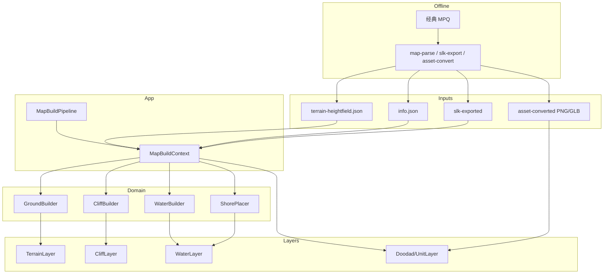

# 地图运行时架构

> 范围：Godot 侧如何把 `assets/map-parsed/*` + SLK + 转换后 GLB/PNG 变成可游玩场景。  
> 不含离线工具链细节（见 README / 各 `tools/*/README.md`）。水体专项见 [WATER.md](WATER.md)。
>
> **重构分支：** `refactor/map-architecture`  
> **进度：** 步骤 1–3 完成 — `MapBuildContext`、单次悬崖拓扑、ModelCache 共用、资源入口统一（AssetProvider + RuntimeAssets.converted_*）。

原则：**离线解析 → 运行时装配 → 分层渲染**。先把边界划清，再谈优化与对标官方。

---

## 1. 现在为什么觉得「绕」

当前能跑 Lost Temple 预览，但结构是「功能堆叠」而非「清晰分层」：

| 症状 | 表现 |
|------|------|
| 命名两套体系 | `Map*`（场景层）与 `Wc3*`（算法）混在同一目录，读代码时分不清「节点」还是「纯逻辑」 |
| Layer 厚薄不一 | `MapTerrainLayer` 很薄（转发）；`MapCliffLayer` / `MapWaterLayer` 又管网格又管材质又管 MultiMesh |
| 数据反复解包 | 各 Builder 各自 `read_heightfield_meta(hf)`，同一张 heightfield 被拆多遍 |
| 职责交叉 | `Wc3CliffTiles` 既服务悬崖 GAP，又被地面 autotile / 水体斜坡跳过调用 |
| 资源入口分裂 | Autoload `AssetProvider`（逻辑路径 → `.cache`）与 `RuntimeAssets`（`asset-converted` 旁路加载）并行，调用方需自己选 |
| 管线写在 Loader 里 | `MapLoader` 顺序硬编码 + 多次 `await process_frame`，扩展新层只能继续往里塞 |

结论：问题不在「某个脚本太长」，而在**缺少中间的「地图数据 / 构建上下文」层**，导致算法与场景节点直接耦合。

### 1.1 具体债清单（调研补充）

| 项 | 细节 |
|----|------|
| **AssetProvider 与 RuntimeAssets 已汇合** | `resolve`：overlay → converted → cache；地图经 `RuntimeAssets.converted_path` / `load_converted_*`，禁止手写 converted 前缀 |
| **GLB 缓存分叉** | ~~Cliff 自建缓存~~ → 已共用 `MapModelCache`；继续盯单位/装饰路径一致性 |
| **悬崖拓扑重复扫描** | ~~多次 collect_ramp~~ → `MapBuildContext.ensure_cliff_topology()` 一次 |
| **常量与 I/O 重复** | `FLAG_WATER` 等仍有多处定义；JSON 读取尚未完全抽公共 |
| **死 API / 死接线** | `HeightfieldMeshBuilder.build_uniform_mesh` 未见调用；`wc3_shore_wave.gdshader` 无运行时引用 |
| **文档与默认开关不一致** | README 写 Lost Temple 含树等预览；`MapLoader` 默认 `place_doodads/units = false` |

依赖关系本身**无环**（Layer → Builder → Coords/RuntimeAssets）；痛点是共享不足与职责膨胀，不是循环依赖。

---

## 2. 离线产物 → 运行时输入

```text
经典客户端 MPQ
    │ tools/mpq-extract
    ▼
.cache/wc3-assets/          （原始 BLP/MDX/…，gitignore）
    │ tools/asset-convert / slk-export / map-parse
    ▼
assets/
  map-parsed/<slug>/        ← 地图 JSON（本架构主输入）
  slk-exported/             ← 表数据（单位/装饰/地形/水体参数）
  asset-converted/          ← PNG/GLB（.gdignore，运行时按需加载）
```

`map-parsed/<slug>/` 关键文件：

| 文件 | 用途 |
|------|------|
| `terrain-heightfield.json` | 高度、水面高、flags、地表/悬崖索引（灰盒主数据） |
| `info.json` | 地图名、flags（如 `waterWavesCliff`） |
| `units.json` / `doodads.json` | 单位与装饰物实例 |
| 其它 | `terrain.json`、`summary.json` 等，预览阶段可选 |

---

## 3. 当前场景与调用链（如实）

### 3.1 场景树

```text
Main (scenes/main.tscn)
├── WorldEnvironment / Sun
├── MapRoot (scenes/map/map_root.tscn) ← MapLoader
│   ├── Terrain / Ground          MapTerrainLayer + HeightfieldMesh
│   ├── Cliffs                    MapCliffLayer
│   ├── Water / Surface           MapWaterLayer + HeightfieldMesh
│   ├── Doodads                   MapDoodadLayer
│   └── Units                     MapUnitLayer
├── OrbitCamera
└── UI/Status
```

### 3.2 加载顺序（`MapLoader._load_all`）

```text
读 terrain-heightfield.json
    → Terrain.build(hf, tiles)      # 地面网格 + 图集
    → Cliffs.build(hf, tiles)       # 悬崖/斜坡 MultiMesh
    → 读 info.json flags
    → Water.build(hf, tileset, flags)  # 水面 + 岸浪
    →（可选）Units / Doodads
```

共享对象：`Wc3TerrainTiles`、`Wc3IdCatalog`、`MapModelCache` 由 Loader 创建并注入。

### 3.3 文件职责一览（`scripts/map/`）

**编排 / 场景层**

| 文件 | 角色 |
|------|------|
| `map_loader.gd` | 读 JSON、建 `MapBuildContext`、排程各层、状态栏 |
| `map_build_context.gd` | 单次加载共享：meta / flags / 悬崖拓扑 / tiles·catalog·cache |
| `map_terrain_layer.gd` | 地面：调 Autotile → 挂 shader |
| `map_cliff_layer.gd` | 悬崖：收集实例 → MultiMesh + height deform（经 MapModelCache） |
| `map_water_layer.gd` | 水面 + 岸浪编排 |
| `map_doodad_layer.gd` | 装饰物 GLB / MultiMesh / 占位 |
| `map_unit_layer.gd` | 单位 GLB / 占位 |
| `heightfield_mesh.gd` | MeshInstance3D 薄封装 |
| `orbit_camera.gd` | 预览相机（非地图逻辑） |

**算法 / 数据（`Wc3*` + 工具）**

| 文件 | 角色 |
|------|------|
| `wc3_coords.gd` | WC3 ↔ Godot 坐标与缩放 |
| `heightfield_mesh_builder.gd` | 规则格 → quad 几何；读 heightfield meta |
| `wc3_terrain_tiles.gd` | 地表/悬崖贴图路径索引 |
| `wc3_terrain_autotile.gd` | 官方图集 bitmask 地面网格 |
| `wc3_cliff_tiles.gd` | 悬崖 TAG、斜坡、GAP 判定 |
| `wc3_cliff_builder.gd` | 悬崖/斜坡实例 transform 收集 |
| `wc3_cliff_height_map.gd` | 悬崖变形用高度纹理 |
| `wc3_water_params.gd` | Water.slk → 贴图序列/偏移/岸线文件名 |
| `wc3_water_mesh.gd` | 水面网格（斜坡不画水） |
| `wc3_shoreline_builder.gd` | 岸浪发射点 |
| `wc3_shore_foam.gd` | 岸浪 MultiMesh + PE2 近似 |
| `wc3_id_catalog.gd` | 四字符 ID → SLK / GLB |
| `runtime_assets.gd` | 旁路加载 PNG/GLB |
| `map_model_cache.gd` | GLB 网格缓存 |
| `map_placeholders.gd` | 缺模占位体 |

**着色器（`shaders/`）**

| 文件 | 用途 |
|------|------|
| `wc3_ground.gdshader` | 地表多层图集 |
| `wc3_cliff.gdshader` | 悬崖贴图 + 高度变形 |
| `wc3_water.gdshader` | 水面序列帧 + 深浅色 |
| `wc3_shore_foam.gdshader` | 岸浪 XYQuad Additive |
| `wc3_shore_wave.gdshader` | ShorelineWave（默认关闭） |

---

## 4. 目标架构（建议）

把代码按**依赖方向**分成四层。上层可依赖下层，禁止反向。

```text
┌─────────────────────────────────────────────────────────┐
│  Presentation（场景节点）                                 │
│  MapRoot / *Layer / OrbitCamera / UI                     │
│  只负责：挂节点、设材质、MultiMesh、清空子节点               │
└──────────────────────────▲──────────────────────────────┘
                           │ 消费 BuildResult / Mesh / Transforms
┌──────────────────────────┴──────────────────────────────┐
│  Application（装配）                                      │
│  MapBuildPipeline / MapBuildContext                      │
│  只负责：读 JSON、建 Context、按序调用 Domain、把结果交给层   │
└──────────────────────────▲──────────────────────────────┘
                           │ 调用纯函数 / RefCounted 构建器
┌──────────────────────────┴──────────────────────────────┐
│  Domain（WC3 规则，无 Node）                               │
│  TerrainAutotile / CliffRules / WaterMesh / ShorePlacer  │
│  Coords / IdCatalog / WaterParams                        │
│  只负责：heightfield → 几何描述或实例列表（不碰场景树）       │
└──────────────────────────▲──────────────────────────────┘
                           │ 读表、读盘、缓存
┌──────────────────────────┴──────────────────────────────┐
│  Infrastructure                                          │
│  RuntimeAssets / ModelCache / JsonIO / AssetProvider     │
└─────────────────────────────────────────────────────────┘
```

### 4.1 关键类型：`MapBuildContext`

一次加载只解析 heightfield **一次**，各系统共用：

```text
MapBuildContext
├── slug / map_dir
├── hf_meta          # width/height/heights/flags/center/tile_size/…
├── info_flags       # waterWavesCliff 等
├── main_tileset     # "I" …
├── terrain_tiles    # Wc3TerrainTiles（已 load）
├── id_catalog       # 可选
└── model_cache
```

Builder 签名从 `build(hf: Dictionary, …)` 逐步改为 `build(ctx: MapBuildContext)`，避免每处再拆 JSON。

### 4.2 Domain 输出契约（示例）

| 系统 | 输入 | 输出（不碰场景） |
|------|------|------------------|
| Ground | ctx | `{ mesh, gap_count, texture_array }` |
| Cliff | ctx | `{ groups: [{ glb, tex_idx, transforms[] }] }` |
| Water | ctx | `{ mesh, cell_count, skipped_ramp }` |
| Shore | ctx | `{ placements[] }` |
| Foam | placements | MultiMesh 描述或由 Layer 直接实例化 |
| Doodad/Unit | JSON + catalog | 实例描述列表 |

Layer 只做：`clear → 取结果 → 创建 MultiMeshInstance3D / 设 shader`。

### 4.3 建议目录（演进，非一次性大挪）

```text
scripts/map/
  app/
    map_loader.gd           # 薄编排 → 将来改名 MapBuildPipeline
    map_build_context.gd    # 新增
  layers/
    map_terrain_layer.gd
    map_cliff_layer.gd
    map_water_layer.gd
    map_doodad_layer.gd
    map_unit_layer.gd
    heightfield_mesh.gd
  domain/
    wc3_coords.gd
    wc3_terrain_autotile.gd
    wc3_cliff_tiles.gd
    wc3_cliff_builder.gd
    wc3_water_mesh.gd
    wc3_shoreline_builder.gd
    …
  infra/
    runtime_assets.gd
    map_model_cache.gd
    map_placeholders.gd
  view/
    orbit_camera.gd
```

搬迁可用 `class_name` 保持兼容，不必一次改完所有 `preload`。

---

## 5. 数据流（目标态）



---

## 6. 演进步骤（建议顺序）

不要大爆炸重构。按依赖从下往上收：

1. **引入 `MapBuildContext`** ✅（`scripts/map/map_build_context.gd`）  
   Loader 组装 ctx；`ensure_cliff_topology()` 单次扫描 romp / gaps / ramp；Terrain / Cliffs / Water 吃 ctx。meta 可下传给 Builder，避免重复 `read_heightfield_meta`。

2. **削薄 Layer + 统一 ModelCache** ✅（Cliff 已接 `MapModelCache`）  
   Layer 以 `build(ctx)` 为主；后续可继续把材质绑定与 Domain 输出契约收紧。

3. **统一资源入口** ✅  
   `AssetProvider.resolve`：overlay → converted → cache（含 .blp/.mdx 扩展名映射）。  
   地图侧一律 `RuntimeAssets.converted_path` / `slk_path` / `load_converted_*`，不再手写 converted 前缀。

4. **目录归位**  
   `domain/` / `layers/` / `infra/` 物理搬家；更新本文档路径表。

5. **清理与对齐**  
   删或标明死 API（`build_uniform_mesh`、未接线的 shore_wave）；预览默认是否启用 doodads 与 README 对齐。

6. **（可选）Pipeline 配置化**  
   `build_water` / `place_doodads` 变成步骤列表，便于测试单层。

每步保持：Lost Temple 主场景可运行 + `tools/selftest_shoreline.gd`（及后续单测）通过。

---

## 7. 明确不做 / 暂缓

| 项 | 原因 |
|----|------|
| 运行时直接读 MPQ | 规划在玩家端 GDExtension；开发期继续用预解析 JSON |
| 完整 PE2 / 触发器 / 寻路 | 预览阶段未开工；岸浪仅近似 |
| 把 Domain 写成 GDExtension | 过早；先把 GDScript 边界划清 |
| 合并全部 `Wc3Cliff*` 为一个上帝类 | 判定与实例化宜保持分离 |

---

## 8. 相关文档

- [README.md](../README.md) — 首次解包 / 转换 / 解析
- [WATER.md](WATER.md) — 水体与岸浪对标
- [WC3_ASSET_PATHS.md](WC3_ASSET_PATHS.md) — 经典资产路径
- [LEGAL.md](LEGAL.md) — 资产合规
