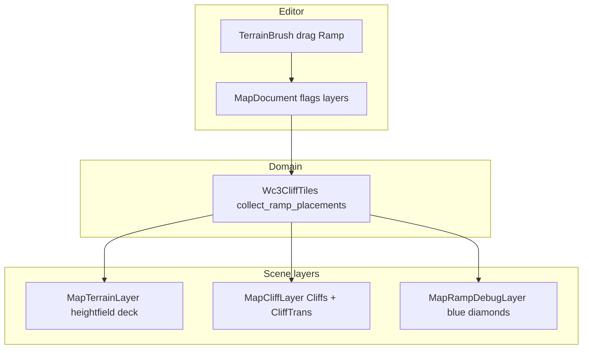

# 斜坡（Ramp）设计与实现路线图

> **状态：设计 + 分阶段路线图。按里程碑迭代；未勾选项不要提前做完。**  
> 直崖见 [CLIFF.md](CLIFF.md)。缺陷跟踪见 [TODO.md](TODO.md)。

---

## 0. 先分清两套「斜坡」（易混）

| | **A. 崖边斜坡（Cliff Ramp）** | **B. 纯高度坡（Ground Height）** |
|--|------------------------------|----------------------------------|
| WE 工具 | 悬崖面板 → **斜坡/山坡** | **应用高度**（抬/压/平整地形） |
| 数据 | `layerHeights` 差 1 + `flagsPacked` 的 **RAMP 旗** | 只改 `heights[]`（地面连续高），层高可不变 |
| 直崖模型 | 条带内 **隐藏 Cliffs**，换 `CliffTrans`（或过渡） | **无崖**，本来就没有 Cliffs |
| 可走面 | 高度场甲板 / 插值 + 可选剖面模 | 地面 mesh 随高度场变形（现有 Terrain） |
| 方向 | 沿直线崖边，竖 1×2 / 横 2×1 条带 | **全方向**，像「拉高某些顶点」 |
| 蓝菱形 | WE：有 RAMP 旗的顶点 | 无（或仅调试自绘） |

截图里「完全没有悬崖模、网格跟着鼓起来、全方向」→ 多半是 **B（应用高度）**，不是 A。  
A 才需要 `CliffTrans` 与「必须先有直线崖边」；**B 不关心斜坡断崖模型**。

本文后续若无特别说明，**「斜坡」= A（崖边斜坡）**。B 归高度笔刷，不占斜坡里程碑主线。

---

## 1. 目标（A）与非目标

### 目标

- **拖动绘制**（按下→拖过合格崖边→抬起提交），不是单点点击乱打旗。
- 双通道：高度场可走面 +（目标态）CliffTrans 剖面；调试期可只开通道之一，但门禁要分清。
- 独立 **斜坡调试层**：蓝菱形标注 RAMP 顶点；不污染地面/直崖主 mesh 职责。
- 条件判断可迭代收紧（R1–R8），模型表作校验而非「先翻模型再画」。

### 非目标

- 用崖边斜坡工具去实现「纯高度鼓包」（那是 B）。
- 一次做完所有 CliffTrans 轴向/拐接 X 片；允许按里程碑先甲板后模型。

---

## 2. 架构与单一职责

**结论：高度图层保持现状；斜坡用独立层 + 领域检测脚本，不要把 CliffTrans 塞进高度场脚本。**

| 职责 | 落点 | 说明 |
|------|------|------|
| 改 `heights` / 层高蛋糕 | `map_document.gd` + 现有传播 | 不新建第二套高度场 |
| RAMP 旗、条带合法性 | `map_document` 笔刷 + `wc3_cliff_tiles` | 条件判断在 Domain |
| 地面可走几何 | `wc3_terrain_autotile` / Terrain 层 | romp 甲板、插值；**不**放 CliffTrans |
| Cliffs / CliffTrans 实例 | `wc3_cliff_builder` + `map_cliff_layer` | 剖面模；可与直崖同层分 bucket |
| 蓝菱形调试 | **新建** `map_ramp_debug_layer.gd`（或并入 PathingDebug 的 ramp 模式） | 只读 flags，不写高度 |

**为何不「斜坡只走高度图脚本」：**  
B 才是纯高度；A 还要旗、romp、缺模、与直崖互斥。塞进高度脚本会破坏 SRP，也难单独开关 CliffTrans / 蓝菱形。

**为何不改「高度图层」本身：**  
tilepoint `heights`/`layerHeights` 仍是唯一真相；斜坡层只是 **表现与调试**，避免双高度源。

---

## 3. 交互：拖动绘制

| 项 | 规则 |
|----|------|
| 按下 | 在指针处找最近「候选崖边」；无效则不开始 stroke |
| 拖动 | 沿边扩展 / 连续覆盖 2 格宽条带；仅写入 stroke 预览或脏区 |
| 抬起 | 提交 RAMP 旗 + 必要层高修正；触发 `rebuild_terrain_cliffs_water` |
| 点击不拖 | 可选：零长度 stroke → 无操作或只刷单条最小条带（实现时定一种并写测试） |

笔刷尺寸影响「沿边搜索容差 / 一次覆盖长度」，**不能**变成任意全方向抹旗（那是 B）。

---

## 4. 条件门禁（可迭代）

实现中以测试驱动逐步收紧；缺模时允许 M1 只甲板，但必须打日志。

| ID | 规则 |
|----|------|
| R1 | 直线直崖边（非角柱/碎折） |
| R2 | 沿边相对层差 **= 1** |
| R3 | 条带 **2 格深**（竖 1×2 / 横 2×1）；宽坡由**相邻多条**拼成 |
| R4 | 一列/行 ramp 全开、对面全关（L\|R 相邻可 `111\|000\|111`） |
| R5 | 中间角高 = 该列/行两端 `min` |
| R6 | TAG∈资源表且 `resolve_glb` 成功（M3 强制；此前可缺模） |
| R7 | 见下「单脊 / 双脊」渲染分流 |
| R8 | 含 X 的 TAG 仅自然 CliffTrans；城市子集无 X |

**CliffTrans TAG 穷举：** 32（自然）/ 16（城市，无 X）。见仓库 `assets/asset-converted/Doodads/Terrain/CliffTrans/`。

### 4.1 单脊线 vs 双脊线（对照 WE，重要）

对照原作：刷**一条**斜坡脊线（一侧 3 个蓝菱形）时，**不会**把脊线两侧四个面都改成可走甲板；侧缝靠 **CliffTrans / 斜坡断崖模** 收口。  
只有刷出**两条及以上**相邻脊线（如底面 2×1 共 4 菱形、顶面 2 菱形那种宽坡）时，才用高度场 / SurfaceTool 甲板把中间缝填实。

| 情况 | 旗 / 菱形 | 直崖 | 可走面 | 侧缝 |
|------|-----------|------|--------|------|
| **单脊线**（1 条 1×2 或 2×1） | XOR 一列/行 3 点 | 条带内跳过 Cliffs | **挖洞** + CliffTrans（不铺甲板） | CliffTrans 收口 |
| **双脊线+**（相邻两线） | `111\|111`（邻列菱形） | 合并 romp | **条带内连续甲板**（不向外扩） | **外侧 CliffTrans** 侧脊 |

注意：横/竖脊扫描时，同一条 3 旗会命中主条与邻格幻影 TAG（共用同一旗列/行）。甲板只认主条；**不得**把幻影对当成双脊线。真宽坡是**相邻两列都有菱形**（`111|111`），不是隔列的 `111|000|111`（后者视觉上像宽 3）。

---

## 5. 调试：蓝菱形 + 栅格

- **蓝菱形**：每个 `FLAG_RAMP` 的 tilepoint 画菱形（对齐 WE）；挂在斜坡调试层，可菜单开关。
- **默认栅格**：编辑器默认 **中级栅格**（白 128），见 `user://editor_settings.cfg`。
- 调试层与 GPU 路径栅格分离，避免再搞「双通路打架」。

---

## 6. 实现路线图（里程碑）

### M0 — 文档与配置（当前）

- [x] 区分 A/B；架构与 SRP
- [x] 编辑器 `ConfigFile` + 默认中级栅格
- [x] 评审本路线图后再动斜坡笔刷

### M1 — 数据笔刷（拖动 + 旗）

- [x] `TerrainBrush`：Ramp 模式拖动 stroke（单顶点搜条带）
- [x] `MapDocument`：按 R1–R5 写 RAMP；非法拒绝并提示
- [x] 自测：`tools/selftest_ramp_m1.gd`
- [x] **蓝菱形调试层**；Y 贴坡面
- [x] **单脊 / 双脊分流**：单条只占条带内 romp；相邻才 `wide` 扩展（对照 WE）
- [x] 仍跳过 CliffTrans；单脊侧缝允许，等 M3 → **已启 CliffTrans**

### M2 — 高度场甲板对齐（双脊线+）

- [x] 宽坡采样连续逻辑已实现（开关关闭时不喂地面 mesh）
- [x] `RAMP_SURFACE_DECK_ENABLED`：当前 **false**（先看 CliffTrans，不改邻面高度）
- [x] 自测：`tools/selftest_ramp_m2.gd`（随开关分支）

### M3 — CliffTrans MultiMesh（单脊线收口）

- [x] 取消 builder 永久 skip；放置 CliffTrans（含幻影对两侧）
- [x] 单脊：romp **挖洞藏面**，不抬邻格；自测 `tools/selftest_ramp_m3.gd`
- [ ] 轴向/位置对照 HiveWE 目视微调
- [ ] TAG 表校验（32/16）；缺模警告（已有基础 warning）
- [ ] 拐接 X 片（可后置 M3b）
- [ ] 独立斜坡高度图 mesh（调试用，后置）

### M4 — 打磨

- [ ] 长边连续拖、撤销/清坡
- [ ] 异种崖策略 B 与水旗冲突策略定稿
- [ ] Lost Temple / 自制四向坡验收
- [ ] 对照 HiveWE 0.3（+ 日后 0.6）

**迭代调试建议：** 每里程碑只开一个变量（先旗+菱形 → 再甲板 → 再模型），避免三处同时调。

---

## 7. 验收总表

- [ ] 拖动绘制；点击策略有文档+测试
- [ ] 蓝菱形与 RAMP 旗一致
- [ ] 默认中级栅格；设置持久化 `user://editor_settings.cfg`
- [ ] A 与 B 工具互不冒充
- [ ] M3 后双通道目视可接受

---

## 8. 相关文件

| 文件 | 角色 |
|------|------|
| `editor/scripts/editor_settings_store.gd`（新） | `ConfigFile` ↔ `user://editor_settings.cfg` |
| `editor/scripts/tools/terrain_brush.gd` | 拖动 stroke |
| `editor/scripts/map_document.gd` | 旗 / 层 |
| `scripts/map/wc3_cliff_tiles.gd` | 检测 / TAG |
| `scripts/map/wc3_cliff_builder.gd` | CliffTrans |
| `scripts/map/wc3_terrain_autotile.gd` | 甲板 |
| `scripts/map/map_ramp_debug_layer.gd`（新，M1） | 蓝菱形 |

---

## 9. 文档状态

| 日期 | 说明 |
|------|------|
| 2026-07-23 | 初稿双通道门禁 |
| 2026-07-23 | 修订：A/B 分流、拖动、独立调试层、M0–M4 路线图 |
| 2026-07-23 | M1：条带笔刷 R1–R5、蓝菱形、`selftest_ramp_m1.gd` |
| 2026-07-23 | 修复：romp 不依赖 CliffTrans GLB；条带优先 slope；直崖变体打散 |
| 2026-07-23 | 修复：斜坡悬停改回顶点框；相邻条带 L\|R 拼旗防互清 |
| 2026-07-23 | 修复：菱形贴坡面 Y；romp 脊线两侧 4 面；拒绝对侧削台 |
| 2026-07-23 | **回退**单脊四格甲板；确立单脊=CliffTrans / 双脊=甲板填缝 |
| 2026-07-23 | 修横脊幻影对误判 wide；单脊 romp 固定 2 格 |
| 2026-07-23 | M2：宽坡采样连续、甲板 mesh 自测、菱形跟入口抬升 |
| 2026-07-23 | M3：启 CliffTrans；关甲板（不抬邻面）；romp 挖洞 |
| 2026-07-23 | 修复：斜坡预览单顶点；邻条可选宽2；幻影格标 romp 消侧脊接缝 |
| 2026-07-23 | **纠正宽2**：WE 为相邻列菱形 `111\|111`，非隔列 `111\|000\|111` |
