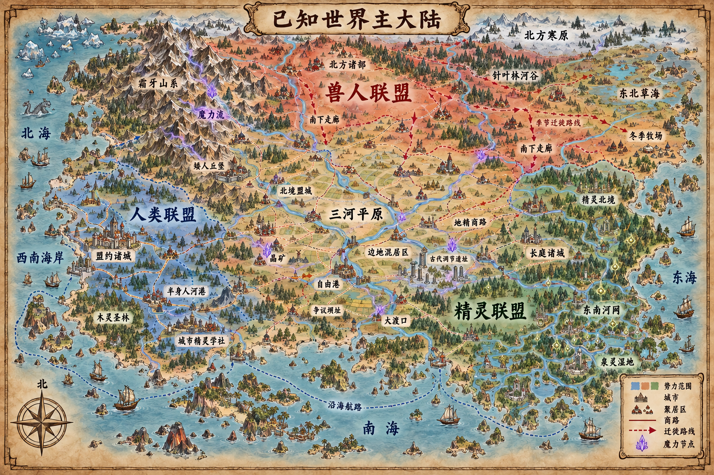

# 世界地理生成逻辑：从板块、气候到魔力生态

> 版本：0.13 · 日期：2026-09-14  
> 状态：世界地理框架提案。日心体系、球形行星与物质—魔力共同规律沿用 [世界底层规则](COSMOLOGY_AND_MAGIC.md)；大陆轮廓、地名、尺度和魔力参数尚未锁定。  
> 目标：建立一套能反复推导地形、资源、文明和冲突的逻辑，同时为战役地图与对战地图提供一致来源。本稿不要求实现动态气候或全球模拟器。

## 1. 地理观：硬约束，软结果

本项目采用“地理压力模型”：地理决定行动的成本、收益、风险与重复发生的机会，进而长期影响生计、交通、技术、制度与战争方式。它不直接决定某个族群的智力、道德或固定性格。

```text
天体条件
  ↓
板块与地形
  ↓
风、洋流、降水与水系
  ↓
土壤、生境、矿产与魔力循环
  ↓
生产方式、交通和人口分布
  ↓
制度选择、联盟与战争
  ↓
工程、战争和魔法反过来改变环境
```

同一片草原可以产生部落联盟、商贸城市或定居帝国；差异来自历史时机、技术、邻国和政治选择。地理给出高概率问题，不替角色作答。

设计一个文明时，至少回答：它如何获取食物和水，如何度过坏季节，什么货物值得远运，哪些道路不能失去，谁负责维护公共设施，灾害来临时谁先付出代价。

## 2. 先生成现实地理，再叠加魔力

魔力不代替板块、重力、水循环和气候。基础地理遵循玩家能够理解的自然规律，魔力作为第二层自然过程改变局部强度、速度和可能性。

推荐按以下顺序设计世界：

| 步骤 | 先回答的问题 | 主要产物 |
|---|---|---|
| 1. 天体 | 纬度、轴倾、海陆受热和季节如何变化 | 气候带与盛行风的大方向 |
| 2. 板块 | 哪里碰撞、俯冲、张裂或经过热点 | 山脉、火山弧、盆地、岛链与地震带 |
| 3. 海陆 | 海岸形状、浅海、内海和海峡如何分布 | 洋流、港口潜力与海洋屏障 |
| 4. 气候 | 风从哪里带来水汽，山脉在哪里制造雨影 | 湿润区、草原、沙漠、季风区与雪线 |
| 5. 水系 | 水从分水岭流向哪里，在哪里渗入地下或形成湖泊 | 河流、冲积平原、湿地、泉眼与含水层 |
| 6. 魔力场 | 哪里产生势差，什么材料导流或储存，谱相是否平衡 | 地脉、节点、静默区、潮汐与异常区 |
| 7. 生态反馈 | 生命如何利用、缓冲或改变当地魔力 | 普通生境、巨型生境、元素活动和危险边缘 |
| 8. 资源与交通 | 粮食、木材、矿物、魔法材料和路线在哪里 | 聚落密度、商路、关隘、港口与争夺点 |
| 9. 历史 | 谁先到来，谁修建工程，灾害与战争改变了什么 | 国家、联盟、边疆、遗址和现实矛盾 |

顺序不是一次性直线。城市修坝会改变河流，精灵育林会改变降水和魔力缓冲，战争废墟会成为新的交通障碍与灵性印记，因此完成第九步后应回看第四至第八步。

## 3. 现实地理骨架

### 3.1 板块与山脉

行星具有缓慢运动的地壳板块。板块边界优先解释长山脉、深海沟、火山和频繁地震；热点可以解释板块内部的火山岛链。魔力会影响局部岩石性质和喷发形态，但不把每座山都解释成巨人尸体。

板块碰撞形成的年轻山脉通常陡峭、地震频繁并暴露深层矿物；古老山系更低缓，拥有长期侵蚀形成的河谷、矿床和稳定通道。文明对二者会发展出不同道路与建筑传统。

### 3.2 风、海洋与雨影

纬度、行星自转、海陆温差、地形和洋流共同决定气候。海洋储存并搬运热量与水分；盛行风遇到山脉抬升降水，背风坡形成更干燥的雨影。

因此，一条山脉可以同时解释：迎风侧森林与密集河流、山地矿产、背风侧草原，以及几种文明长期相邻却生计不同。它比“每个种族拥有一种气候”更自然。

### 3.3 水系与地下水

河流从分水岭向低处汇流，流域是比国界更稳定的地理单位。上游筑坝、毁林或魔力工程会影响下游洪水、泥沙、鱼群与地脉状态，因此特别适合承载三大联盟的政治冲突。

地下水主要储存在土壤和岩石孔隙、裂隙与含水层中，缓慢流动并通过泉水、河流和湿地返回地表。世界中的地下水可以携带魔力，但不默认存在遍布地下的空心“水河”。

## 4. 魔力也有地理循环

魔力既是能源，也是能够保存结构的媒介。为了避免它成为任意解释，任何地区的魔力环境都用五项描述：

| 属性 | 含义 | 地图上的表现 |
|---|---|---|
| 浓度 | 单位环境中可用魔力的多少 | 施法补给潜力、元素活动、材料价值 |
| 势位 | 魔力倾向从哪里流向哪里 | 地脉方向、汇聚点和泄放口 |
| 导性 | 当地物质允许魔力通过的能力 | 河流、矿脉、晶体层、生物网络或隔绝岩层 |
| 谱相 | 生化/衰亡、聚合/解离等倾向的比例 | 生境类型、法术偏向和异常性质 |
| 稳定度 | 魔力结构受到扰动后恢复常态的能力 | 法术可靠性、魔潮、灾变与长期恢复速度 |

区域还可以记录“历史印记”：长期重复的生命、仪式、战争或工程，使当地魔力更容易沿既有结构重新组织。印记影响概率和效率，不是一段能准确播放全部历史的录像。

最简单的收支关系是：

```text
本期储量 = 上期储量 + 流入 + 当地转化 - 流出 - 耗散 - 人为抽取
```

魔力大体从高势位沿高导性路径流动，也可能被晶体、生境或设施暂时储存。一个节点被开采后不会瞬间从宇宙刷新；恢复速度取决于上游输入、当地转化和结构是否仍完整。

### 4.1 四个循环层

| 循环 | 速度 | 作用 |
|---|---|---|
| 深层循环 | 极慢 | 地幔热、压力、板块摩擦和矿物相变使魔力在深部转化；决定大地脉与晶矿带 |
| 水文循环 | 中等 | 雨水、河流、地下水与海洋搬运和稀释魔力；形成泉眼、河口与湿地节点 |
| 生命循环 | 从季节到世代 | 生物吸收混合魔力并重新组织；森林、草原和菌群能缓冲极端谱相 |
| 大气循环 | 快 | 阳光、风暴、尘埃和高空流动搬运稀薄魔力；形成短暂魔潮、极光和雷暴异常 |

月相与天象可以调制这些循环，不能凭空创造全部能量。一次魔潮应能追溯到储量释放、流路改变、天体调制或多个因素叠加。

### 4.2 物质如何影响魔力

- 晶体和部分金属适合储存、定向或放大特定结构，因此富矿山系也会成为魔法工业中心。
- 流动水导引并混合魔力，瀑布、汇流处、泉眼和河口容易形成活跃节点。
- 盐、黏土、玻璃、某些变质岩或人工合金可以隔绝、滤除或改变谱相，具体材料表后置。
- 活体能够把环境魔力组织进自身循环；多样生境通常比单一生境更能缓冲突变。
- 尸骸与废墟保存短期结构印记，但不会仅因发生过死亡就永远产生邪能。

### 4.3 魔力如何反过来改变地理

低至中等浓度时，魔力主要改变生长速度、材料性质和生物适应。高浓度、强势差或谱相失衡时，才产生明显奇观：异常晶化、快速侵蚀、元素聚合、局部重力偏移、长期雾域或不合季节的生长。

改变遵守尺度和代价：让一块岩石悬浮数日，比让整座山永远悬浮容易；维持一片反季节果园，需要持续供能和养分，不能只靠一次祝福。

## 5. 五类魔力地貌

| 类型 | 形成 | 典型价值 | 典型风险 |
|---|---|---|---|
| 地脉 | 深层势位与高导性地质结构形成的长期流路 | 稳定供能、矿藏、设施选址 | 过度截流影响下游，断层活动时可能突变 |
| 节点 | 多条流路汇聚或储存结构暴露 | 城市、圣所、魔法工坊与战略据点 | 争夺激烈，过载会释放元素与异常天气 |
| 魔潮带 | 大气、水文或季节循环造成的移动高浓度区 | 季节性采集、仪式与迁徙路线 | 位置变化，误判会导致法术失控或生境损害 |
| 静默区 | 低导性材料、长期枯竭或结构破坏造成的低浓度区 | 避免侦测、保存某些危险物 | 治疗与法器补给困难，生态恢复缓慢 |
| 伤痕区 | 战争、灾变、恶魔裂隙或大型工程破坏了原有循环 | 稀有材料、遗址与研究机会 | 谱相失衡、亡灵印记、异常侵蚀和裂隙复发 |

“伤痕”描述系统受损，不自动等于道德污染。恶魔会利用不稳定、边界薄弱之处，但沙漠、沼泽、夜晚和火山本身都不是邪恶地貌。

## 6. 魔力生态的反馈规则

魔力与生态之间必须有反馈，避免“魔法森林永远无代价丰饶”。

1. **生命重组魔力。** 多样生命网络将剧烈、偏相魔力转化为较稳定循环。
2. **魔力促进生命。** 适量生化倾向提高修复与繁衍；过量会造成失控生长、竞争和畸变。
3. **死亡归还资源。** 正常凋亡释放物质与魔力，为新生命所用；阻止一切死亡同样破坏循环。
4. **单一化降低韧性。** 大片单一作物或魔法培育林能高产，却更容易被一种病害、谱相变化或法术攻击击穿。
5. **抽取存在时间差。** 一代人可能享受魔力开采收益，数十年后才出现泉水衰减、土壤疲劳或元素迁移。
6. **恢复具有路径依赖。** 停止开采不一定立即回到原状；河道、物种和地脉结构可能已经改变。

精灵的优势可以来自长周期记录与生境管理，不能写成“天生与自然和谐”。他们也会犯过度稳定、排斥更新或把别族生计排除在保护范围之外的错误。

## 7. 主舞台的宏观地理提案

首部作品聚焦北半球中纬度至亚热带的一块主大陆。新版采用北冷南热的主梯度，山地、平原、草原和森林彼此穿插；政治边界由河流、道路、城市网络与历史战争形成，不与生物群系边界重合。



地图 v3 将三方关系改为可持续角力的战略结构：兽人联盟拥有北方纵深并沿河谷南压，人类联盟立足开放的西南海岸，精灵联盟控制东南河网与海岸；三方共同进入三河平原。气候、植被和山脉连续变化，势力范围则沿城市、道路、河运和迁徙路线交错。v0.10 又确立了玻陨荒原与地下机械遗迹、三河共有圣城、圣城远征时代、初衡台、海外析光城，以及云泽半身人转盟后形成的精灵西部政治飞地；这些内容尚未完整反映在图中。在文档锁定前暂停重绘，地图 v3 只作为当前空间草图。此前被否决的 [地图 v2](../.images/世界地图-主大陆羊皮纸-v2.png) 仅保留为方案演进记录。

### 7.1 历史类比是一组结构工具

“三国”仍用于说明首部作品的三方战略几何：北方势力拥有纵深并持续南压，西南势力依靠组织和开放海岸维持守势，东南势力依靠河网与海运形成独立力量。它不负责解释各联盟内部的社会结构。

宋、辽、金与蒙古并立和递嬗的历史更适合解释这个世界的边疆层次：商业化城市与北方政权并非被一条国界永久隔开；草原、针叶林河谷和农牧过渡地带能够先后产生不同的统治集团；互市、岁币、人口迁徙、技术交换与战争长期并存。

| 历史结构参考 | 在本世界中的转译 | 明确不照搬的内容 |
|---|---|---|
| 三国的三角制衡 | 兽人、人类、精灵三个可玩联盟都能进入中央平原，任意两方可暂时结盟 | 不复制现实中国轮廓、人物、正统观或具体战役 |
| 宋的城市、财政和海运能力 | 人类联盟依靠港口、工商业、堡垒链、工程体系和跨族契约维持较小但高组织度的领土 | 不把人类写成唯一“文明”，也不把技术优势写成道德优势 |
| 辽式跨生态治理 | 兽人联盟中的北方王庭可以同时承认草原盟誓、河谷习惯法和定居城市税制 | 不按现实民族建立一一对应关系 |
| 金式林地—河谷力量兴起 | 针叶林河谷的渔猎、林业和河运共同体可能军事化，挑战旧草原王庭并接管农牧边城 | 不把政权更替解释成某个族群的天性 |
| 蒙古式草原整合与驿路 | 某位共主可能通过盟誓、战利品分配和驿站体系，把多个北方政治体临时整合成南下力量 | “统一”是特定历史阶段，不是兽人永恒状态 |

因此，三个可玩联盟是跨族、跨地区的军事政治共同体，不是三个内部统一的民族国家。尤其是兽人联盟，其红色势力范围内部至少包含草原王庭、针叶林河谷诸部、定居边城和暂时服从共主的附盟；这些成员可以在战役中发生继承、叛离、兼并和重新结盟。

### 7.2 新大陆骨架

```text
                         北方寒海
                           北方寒海
西北高原 ─ 百泉走廊 ─ 北境寒原、北方大河 ─ 东北草海
矮人诸堡   地精商路          兽人联盟腹地       ╲
    │          │             三河平原       针叶林河谷
西部丘陵 ─ 人类北境据点 ─── 混居边地 ───── 精灵北境长垣
    │          │                │                │
湖盆诸邦 ─ 人类联盟腹地 ─ 中部低岭 ───── 东南河网
半身人       西南沿海平原 ╲  沿海航路  ╱     精灵联盟
                       西南暖海 ─ 析光岛城 ─ 南方暖海
```

- 气温总体随纬度由北向南升高，北方为寒原、针叶林和冷凉草原，中部为温带平原、疏林与丘陵，南方为暖湿海岸、河网与常绿林。
- 山地集中在西北板块碰撞带及大陆中部若干古老低岭，不再形成贯穿大陆的墙。宽阔河谷、低鞍部和沿海平原提供多条东西、南北通道。
- 三条大河在中部冲积出“三河平原”，随后分别流向西南海、东部湖群与东南河网。这里不是封闭盆地，而是三方移民、贸易和战争反复经过的开放腹地。
- 西南海岸适合农业、港口与城市群；人类联盟由海路直接联系精灵海岸，也能沿西部丘陵和三河平原接触兽人南缘。
- 东南暖湿河网适合精灵园林城市与水运；其北部丘陵、湖群和混居边地与兽人联盟直接相邻。
- 兽人联盟控制广阔北方，却并非只生活在同一种草原。联盟包含寒原牧区、针叶林渔猎区、大河聚落和中部农牧过渡区。

### 7.3 两条性质不同的北方边疆

#### 百泉走廊：人类与兽人之间的狭长陆路

百泉走廊位于西北矮人高原与内陆盐风盆地之间，是一条由冲积扇、泉眼和狭长可耕地串成的南北通道。它北接兽人草海和北方大河，南抵人类联盟的西部丘陵与河运网络。盐风盆地深处包含熔融玻璃、异常磁矿和规则竖井密布的**玻陨荒原**，晶格群的地下铸城由此向高原矿脉延伸。周围并非绝对无法穿越，但大军、车队和牲畜只有沿泉水链行进，补给成本才可承受。

地精并不拥有整条土地。数代商会通过修井、维护栈站、统一车轴和度量、提供跨境信用、购买关隘通行权并掌握水文及遗迹入口情报，取得事实上的运输优势。人类边侯、兽人王庭和矮人高原诸堡都能占领某座关隘，却很难在不依赖地精账册、向导与补给组织的情况下经营全线。

和平时，走廊向南运输马匹、皮革、盐和北方药材，向北运输粮食、金属器、火药原料与海运舶来品；战争时则围绕井站、债务、护商权、禁运和高原侧翼展开。地精商会内部存在亲人类、亲兽人、亲矮人、维持中立与谋求商站自治的派系。

#### 针叶林河谷：兽人与精灵之间的直接通道

针叶林河谷沿一条源自东北高地、最终汇入精灵北境湖群的大河展开。夏季可以行船和放排，冬季封冻后反而形成冰上道路，春季融雪洪水会暂时切断交通。谷地提供木材、鱼类、毛皮、药材和有限农地，沿岸分布兽人渔猎部落、定居村镇、木灵领地与精灵守林庭。

精灵在河谷南口修建北境长垣，却无法封闭整条河。兽人可以沿冻结河面、支流和林间旧道绕过部分关塞；精灵也需要上游木材、水文数据和地方盟友。因此权力来自渡口、河港、冬营地、堤坝关城和季节契约，而不是一条不可穿越的国界线。

| 对比项 | 百泉走廊 | 针叶林河谷 |
|---|---|---|
| 直接相邻者 | 人类联盟—兽人联盟，矮人高原从侧翼介入 | 兽人联盟—精灵联盟，人类通过贸易和援军间接介入 |
| 主要环境 | 干旱高地间的泉水与冲积扇链 | 寒温带森林、大河、支流与季节冻土 |
| 控制方式 | 井站、关隘、信用、车队和补给标准 | 渡口、河港、冬营地、长垣关城、地方盟约和水运 |
| 网络优势者 | 地精商会 | 多个兽人部落、精灵边庭与木灵共同体并存 |
| 战争形态 | 夺关、断水、禁运、围绕商站与高原侧翼的大规模争夺 | 袭扰、封河、攻关、争夺营地与地方势力反复选边 |
| 叙事作用 | 让人类和兽人拥有长期互市、外交与正面战争的共同舞台 | 让兽人与精灵拥有混居史，并使长垣成为可争议的制度而非绝对屏障 |

### 7.4 地貌与势力范围必须错位

新版地图遵守以下规则：

- 人类联盟包含沿海平原、丘陵、山地矿区和三河平原上的孤立城镇，不是一整块蓝色森林。
- 兽人联盟从北方寒原跨越针叶林、草原和河谷，并沿两至三条走廊向南延伸；南方也存在已定居的兽人聚落。
- 精灵联盟覆盖东南河网、海岸丘陵和部分中部温带森林；精灵生境并不在国界处突然结束。
- 析光城位于人类—精灵航路上的海外岩岛，其学院驻所、商站和流亡者家庭分布于人类港口及三河平原；人类商站也存在于精灵许可开放的河港。
- 三方边疆使用半透明重叠、附庸、飞地和混居区表示，不绘制三条贴着森林或山脉边缘的整齐色块。
- 北方冷、南方热是全球气候趋势；局部海拔、洋流、盛行风和魔力环境仍会制造例外。

### 7.5 魔力骨架

深层魔力沿西北山地和中部低岭断续上涌，再被三条大河、地下水和生境网络重新分配。主要地脉同地形有关，却不构成政治边界。

1. 西北晶矿带支持矮人工艺，也吸引兽人北境部族与中立矿业势力争夺。
2. 三河平原是水流、道路和魔力流的共同交会区，适合城市与农业，也容易因大型工程产生连锁影响。
3. 北方大气魔潮具有季节南移现象；严寒、牧草衰退或魔潮偏移都可能加剧兽人南下，但政治领袖仍决定采取贸易、迁徙还是战争。
4. 东南生命网络能缓冲来自上游的偏相魔力，精灵因而重视整条流域，而不只关心自己国界内的森林。
5. 沿海魔力流与潮汐结合，使西南—东南航线具有商业和宗教意义，也让人类与精灵无法彼此隔绝。

## 8. 政体与关键城市

### 8.1 三个联盟采用不同的政治组织

| 联盟 | 推荐政体 | 空间表现 | 对游戏调性的影响 |
|---|---|---|---|
| 人类联盟 | **盟约诸邦**：沿海王国、公国、自由市、矮人高原诸堡和析光城邦共同缔约；少数半身人旧盟城保留特别关系；战时统帅和盟主权力有期限 | 没有一座城市天然统治全部成员；道路、港口、议会席位与共同堡垒维系联盟 | 强调英雄出身多样、诸侯协商、城市竞争和危机中的联合，而不是单一帝国军团 |
| 兽人联盟 | **共主盟誓**：草原王庭、针叶林河谷诸部、定居边城和附盟在大会上承认共主 | 政治中心随季节、继承与军事形势变化；驿路、牧道和战利品分配比固定国界重要 | 强调统一进程、部族自主、继承危机和联盟可能迅速扩张或裂解 |
| 精灵联盟 | **长庭王朝与远枝盟约**：长庭维持共同历法、河网工程、典籍解释和对外古约；云泽半身人诸邦以平等条约加入，地方林庭与神话盟邦保有自治 | 东南核心流域与西南湖盆并不接壤，依靠三河道路、南海航线、档案与共同工程维系 | 强调古老秩序能否容纳独立近亲文明；开门革命、析光战争与云泽转盟分别挑战知识、正统和血缘政治 |

人类最接近中世纪复合君主制和城市联盟，兽人最接近处于整合期的北方多政体联盟，精灵则是中央合法性最强的礼制—水利王朝。精灵并非现代集权国家：长庭能宣布一条河的共同义务，却未必能直接任免每片圣林的守护者。

人类联盟不固定为“七国”。具体成员数量应随历史变化，并允许灭亡领邦、分裂继承、自由市升格和新成员入盟。这样既避免复刻现成设定，也让盟约本身成为持续运转的政治制度。

### 8.2 城市生成规则

主要城市不能先有名字再寻找理由。每座城市至少要同时满足四项中的三项：稳定剩余粮食或能源、交通汇合或瓶颈、可防守位置、能够持续处理契约与公共工程的机构。

历史按以下顺序自然生成：**地理机会 → 季节营地或渡口 → 市场与仓储 → 城墙和公共工程 → 征税与法律 → 身份认同 → 争夺其合法性的战争。** 魔力节点可以强化一座城市，却不能替代水、粮食和交通。

### 8.3 第一批十座世界级城市

以下均为工作名。它们是下一版世界地图必须优先标出的城市，城堡、村镇和遗迹不与它们争夺视觉层级。

| 城市 | 当前政治归属 | 为什么存在 | 自然产生的历史矛盾 |
|---|---|---|---|
| **盟潮城** | 人类联盟；沿海王国领地，也是盟约议事会常驻地 | 西南大河入海口具有深水港、冲积粮区和沿岸航路，可同时供养舰队、工坊和庞大市场 | 沿海王室试图把“会议所在地”变成永久首都；自由市和山堡担心联盟被一国吞并 |
| **炉门城** | 矮人高原王国的东部门户；以独立盟国身份加入人类联盟 | 高原矿路在此穿出峡谷并接上百泉走廊南段与人类河运，是矿石、煤炭、木材、盐和粮食的换装点 | 高原王室主张山口与上游水权，人类边侯需要河运，地精商会控制车队，兽人则试图从北侧切断它 |
| **云泽城** | 半身人湖盆诸邦的盟会城市；远枝盟约后成为精灵联盟西部成员 | 西南高原与海岸之间的暖湿湖盆能够稳定灌溉，数条山路、河道和盐茶商路在此汇合 | 它位于人类与矮人之间却政治上亲近精灵；沿海王国失去内陆通道优势，亲人类旧盟城又反对盟会替全湖盆作决定 |
| **三河城** | 共有圣城与混居自治市；三方都主张最终主权 | 位于三条大河汇合处上方的防洪岩台，控制桥梁、渡口、粮仓和被三方赋予不同意义的“初衡台” | 兽人依据祖先盟誓与季节使用权、精灵依据建设维护与古约、人类依据守城牺牲与成文圣约提出主权；市民则依据连续居住要求自治 |
| **合帐城** | 兽人联盟共主的主要驻地 | 北方大河渡口、草原牧道和东西驿路在此汇合，原本是季节大会与牲畜市场 | 统一者修建永久仓库和城垣后，旧部族质疑共主正在把盟誓变成世袭国家 |
| **杉渡城** | 兽人河谷诸部占优势的混居边城 | 位于针叶林河谷最后一个全年可靠的渡口，兼营木材、船只、鱼盐和冬季冰路 | 兽人王庭、精灵守林庭和地方木灵都声称拥有不同季节的管理权，居民常在战争中重新选边 |
| **百栈城** | 地精商会共同体；接受人类、兽人和矮人多方特许而不正式入盟 | 位于百泉走廊中段最大的泉群、玻陨荒原安全路线与道路分岔口，集修车、换畜、仓储、结算、遗迹检疫与护商仲裁于一体 | 人类与兽人都想控制此城，矮人能从高原切断侧路；商会内部围绕中立、遗迹坐标垄断、危险技术公开和武装自治持续斗争 |
| **长庭城** | 精灵联盟王朝中心 | 建在东南湖群出口的稳定岩岛与多河交会处，能够统一调度水利、航运、魔力缓冲和档案 | 上游工程会影响整个河网；长庭以维护责任主张最高裁决权，离庭者则指责它借生态义务垄断知识 |
| **青门城** | 精灵联盟北境庭；居民高度混合 | 位于针叶林河谷南口、北境长垣与精灵湖运网络的接口，是河运、堤防、检疫和边贸中心 | 精灵守约派要求严格封关，兽人河谷诸部主张恢复季节通行，木灵反对军事工程破坏河岸，人类则以援军换取驻港权 |
| **析光城** | 多族魔法城邦；以主权盟国身份加入人类联盟 | 位于人类与精灵海路之间的岩岛，拥有天然深港、易守高地和稳定但复杂的魔力汇流；流亡舰队最初在此建立要塞 | 长庭要求归还典籍并审判部分创始人；人类盟友担忧危险研究却依赖其法师；城市内部争论开放知识与安全监管的界线 |

### 8.4 城市如何把三方拉进同一段历史

- 三河城决定中央平原的军粮与过河能力，人类、兽人与精灵都必须在城内培养支持者，而不能只在边境摆放军队。
- 炉门城、百栈城和兽人北口关市构成百泉走廊的三个权力节点：高原诸堡控制侧翼与金属，地精掌握信用和车队，兽人王庭控制北方市场与军事出口。
- 杉渡城与青门城把针叶林河谷变成真正的混居边疆。前者依赖地方季节契约，后者执行长庭成文古约和封关命令，两种治理方式会持续冲突。
- 析光城处在人类与精灵海路之间，既能充当贸易中介和共同抵御恶魔的前哨，也能利用港口、传送研究和流亡者网络绕开长庭封潮令。
- 盟潮城与长庭城即使在北方共同作战，也会围绕析光城的主权、舰队补给、商税、岛屿灯塔和革命流亡者身份争执。
- 合帐城是否从季节大会变成永久首都，将决定兽人联盟更接近松散盟誓、辽式跨生态治理，还是进入由新王朝支配边城的阶段。
- 云泽城虽然位于人类与矮人之间，却通过远枝盟约加入精灵联盟；其陆路依赖三河平原，海路依赖泽冠港口，使人类封锁、地精运输和精灵援助同时影响湖盆政治。

这些城市首先是交通和制度节点，其次才是阵营装饰。城市易手时，居民、市场和旧法不会整体消失；新的占领者必须决定沿用、改造还是摧毁原有制度，由此继续产生历史。

### 8.5 三河城：三方共有的圣城

三河城承担类似耶路撒冷的叙事功能，但不复制现实宗教、建筑或历史事件。它的核心不是“大家恰好崇拜同一位神”，而是同一块地理空间被不同文明连续使用，每一层历史都留下仍在运转的制度、遗迹、墓地和记忆。

城市建立在三条大河汇合处唯一长期高于洪水的岩台上。岩台下方同时交会水流、地下断层和稳定魔力流，古代调节设施“初衡台”（工作名）能够分洪、灌溉并缓冲魔力谱相。初衡台不是已证实的世界起源，也不证明任何一方神话为真；它只是极其古老，而且能被三种魔法传统以不同方式操作。

三方乃至本城居民对它使用不同名称：

| 称呼 | 使用者 | 神圣意义与主权依据 |
|---|---|---|
| **祖誓渡** | 兽人诸部 | 在城市和精灵设施出现以前，诸部已沿季路在枯水期渡河、安葬祖先并举行停止复仇的大会；第一份跨部族大盟誓据说在岩台立下。主权来自祖先记忆、反复使用与不可被截断的季路 |
| **初庭** | 精灵长庭 | 早期守约者在洪灾后修建初衡台、种植记忆林并连续维护下游生境。长庭认为维护者承担数百年代价，因此拥有解释设施和保护流域的最终责任 |
| **圣约城** | 人类联盟 | 一次恶魔或亡灵灾潮中，人类、矮人、半身人和精灵流亡者共同守城，并在胜利后签订后来盟约制度的原型。主权来自共同牺牲、重建、成文法和对朝圣者的保护 |
| **三河城** | 本地居民、商人及中立外交 | 强调城市在所有征服者之间仍保持连续生活。市民认为圣地不是无人土地，外部历史记忆不能取消居民自治、财产与选举产生的公议会 |

考古层不提供简单裁决：兽人营火坑与墓标可能最早，却无法证明现代王庭继承全部古代部族；精灵确实维护初衡台最久，却曾驱逐不愿接受古约的居民；人类联盟完成最近一次大规模重建，却可能把战时保护权扩大为永久驻军权。四方都有证据，也都有历史断裂。

#### 当前治理

城市目前依靠“三河公约”维持脆弱自治：本地公议会处理税收、治安和水利，三方各自管理有限的圣区与朝圣机构；任何联盟只能在城外驻扎规定数量的护卫。初衡台核心需要三套不同知识共同开启，但这是一项历史形成的技术事实，不是宇宙指定三族共同统治。

最终公约誓本交换后的下一年被定为“公约纪1年”，当前时代暂定公约纪327年。三河城因此是共同纪年的起点和跨文明档案换算中心，但不是行星或宇宙的物理中心。完整纪年与里程碑见 [世界编年史与衡约诸传](CHRONICLE_AND_COVENANT_TRADITIONS.md)。

公约无法消除冲突。三方都会资助学校、施粥所、墓园修复、商会和民兵来扩大影响；每次洪灾、考古发现、宗教游行、驻军越界或设施故障，都可能让“保护圣城”成为开战理由。

#### 圣城远征时代留下的空间层

完整历史见 [圣城远征时代](WORLD_AND_ALLIANCES.md#34-圣城远征时代)。世界地图和地区地图需要留下能够证明战争确实改变过地理的结构：

| 空间遗产 | 地理位置与功能 | 当代矛盾 |
|---|---|---|
| 西南朝圣大道 | 从盟潮城经人类北境据点进入三河平原，沿途分布旅舍、医院、墓园与旧护领堡垒 | 人类要求武装护送权；三河公议会担心护送队变成驻军 |
| 北岸祖誓道 | 沿北方大河和旧季路进入祖誓渡，连接卡赫兰时代的营垒与兽人墓标 | 兽人要求全年开放；农庄和城墙已占用部分古道 |
| 东部初庭水道 | 将长庭、青门城与初衡台相连，是精灵工程队进入圣城的主要路线 | 精灵要求维护船免税，市民认为长庭借工程权干预城政 |
| 护城领堡链 | 第一批远征者沿河阶地建立的一串石堡，控制桥梁、粮仓和朝圣大道 | 有些由人类后裔继承，有些成为三河自治镇，归属不能用一条边界概括 |
| 芦原战场 | 三河城外季节性湿地与高地交界，卡赫兰在此击败护城领主力 | 三方纪念仪式日期和叙事不同，排水开垦会破坏墓地与战场遗迹 |
| 城外赎俘营与撤离道 | 卡赫兰收复圣城后登记赎金、交换俘虏并让部分守军撤离的地点 | 人类视为宽仁证明，兽人穷户后裔则质疑贵族为何能用金钱脱身 |

远征留下的堡垒、道路和土地特许把人类政治影响嵌入三河平原；卡赫兰时代的驻军地和墓园又把兽人权利嵌入城郊；精灵水道则穿过双方控制区。地图因此不能把圣城周围涂成单一阵营色。

公约纪后的两次大陆战争又把冲突扩展到三河以外。第一次大陆战争主要沿百泉走廊、三河平原和针叶林河谷展开，促成百栈城武装中立；第二次大陆战争同时波及北境长垣、云泽通道和南海航路，今日堡链、难民聚落、废弃信标和军用港口多由此形成。

#### 对战役与玩法的价值

- 同一座城市可以在三个阵营战役中呈现完全不同的地名、地图说明和胜利目标。
- 争夺重点是城门、桥梁、朝圣道路、档案馆、供水与初衡台控制室，不应默认以摧毁圣区取胜。
- 玩家可以面对“取得军事胜利但失去合法性”的选择，例如征用粮仓、破坏墓地捷径或允许盟军进入禁区。
- 恶魔与亡灵可以利用地下设施，却不能成为三方冲突的唯一原因；即使外敌被击败，圣区、驻军和主权争议仍然存在。

三河城应当是贯穿多条战役的合法性焦点，不是所有战争的唯一起因。百泉走廊、针叶林河谷、析光城与沿海贸易仍拥有独立矛盾，避免整个世界缩小成对一座圣城的反复争夺。

## 9. 地理如何塑造三大联盟

### 9.1 人类联盟：开放的西南守势

人类联盟位于西南沿海平原、低丘和西北矿山南缘。它没有不可逾越的天然屏障，主要通过堡垒链、河防、道路和舰队组织防御。海港让它能够绕过陆上压力，与精灵贸易、争夺岛屿，或从海上支援东部战场。

西北高原上的矮人诸堡不是人类王国的矿业行省，而是曾建立高原霸权、控制上游水源和山口的独立盟国。其历史结构可以借鉴吐蕃等高原政权对河谷、商道和低地王朝的影响，但不移植现实宗教和民族形象。丰富矿产、高差水力和长期山地工程传统使其发展出冶金、火器与坚固道路；它与人类结盟源于百泉走廊防务、港口需求和共同敌人，而非天然从属。

半身人诸邦位于高原与西南海岸之间的暖湿湖盆和河谷。其结构可以借鉴大理等西南区域政权：依靠灌溉农业、山地商路、湖运和灵活外交维持自治，处在强邻之间却不是等待吞并的小国。它们曾长期加入人类盟约并提供粮食、仓储和内陆通道；云泽继承危机后，多数诸邦通过远枝盟约转入精灵联盟，少数西部城邦仍维持人类旧约。

这次转盟不移动湖盆，也不把它染成一块孤立的精灵领土。云泽依靠两条脆弱联系接入东南：经三河平原的陆上驿路，以及沿西南暖海通向泽冠诸庭的航线。人类联盟能够封锁其中一条，地精商会影响另一条，因而半身人的政治选择把三方竞争直接嵌入西南腹地。

精灵激进派流亡者在海外建立析光城，并以独立城邦身份加入联盟；其学院在开放港口和三河平原设有驻所。人类联盟的战略优势是工业、金融、跨族组织和内外线交通；弱点是成员利益复杂、领土狭长、人口和北方纵深不足，北境据点与高原盟国都可能被切断。

### 9.2 兽人联盟：北方大国与南下压力

兽人联盟横跨北方寒原、针叶林、大河和东北草海，拥有最大的土地纵深与潜在人口。严寒周期、牧场波动、魔潮南移、部族竞争和统一者建立的新军政体系共同推动南下。

“争夺生存空间”能解释普通部族为何支持迁徙，不能自动为征服开脱。联盟内部会争论：开放旧季路、建立互市、接受定居土地，还是把南方城镇变成贡赋对象。北方优势在于规模、机动与多路进军，弱点是补给距离、内部盟誓和不同生计部族之间的协调。

北方内部继续按生态细分：东北草海形成兽人王庭与跨部驿路；针叶林河谷形成渔猎、舟运和林业共同体；北方冻湖容纳寒泽民等两栖舟民；西部风口与草海路线容纳风蹄民；山口悬崖则是崖翎民的自治巢城。它们的分布与政治归属不完全重合，部分共同体加入兽人联盟，部分保持中立或与地精、人类签订合同。

狼群沿草海—寒原交界繁殖并追随猎物迁移，其路线与兽人季路部分重合。“灰途盟”由这种长期互惠产生，不把狼简化为军用坐骑。北方地域与盟族提案见 [精灵地域文明与北方盟族](CULTURAL_REGIONS_AND_NORTHERN_PEOPLES.md)。

### 9.3 精灵联盟：东南河网与海权

精灵联盟位于温暖的东南河网、湖群、沿海丘陵和岛屿。水道承担运输、灌溉、生境维护与魔力调节，使精灵能够快速沿内河和海岸调动力量，也必须保护漫长的水利网络。

北方兽人南下首先冲击精灵控制的湖群和林缘；人类舰队和商人则直接进入精灵海域。精灵的优势是富庶流域、水运、长期记录和生境盟友；弱点是河口与水利枢纽集中、内部古约复杂，以及分家造成的知识与人口外流。

精灵是文化与制度高度发达的农耕—园林文明。稳定河网、精细灌溉、林园复合生产和长周期魔力管理使其通常不需要以占领大片新土地解决财政问题，但这不等于天然和平。长庭更常通过控制上游工程、建立缓冲庭、要求邻邦承认水系义务和输出古约秩序来扩张影响；必要时也会发动边境战争和海上惩戒，只是较少采用大规模移民吞并。

精灵联盟内部至少有三个连续而非封闭的地域：长庭本域占据东南大河与温带湖群；雨历诸庭分布在更南方的季雨林和石灰岩台地，城市围绕天然水井、蓄水池与观测台形成；泽冠诸庭占据暖热湖盆、浅滩和三角洲，以岛城、堤道、运河、人工农圃和水上市集连接附属城市。这三片文化区与气候带相交，不应在地图上画成边缘笔直的三块阵营色。

#### 封潮令：有期限、分港口的海上管制

数代以前，一支远洋船队带回未知遗物与失去物质容器的能量意志。部分商人、学宫施术者和宫廷官员试图研究并利用它们，最终引发“黑帆之灾”（工作名）：恶魔性意志通过港口结界和货运网络扩散，数座沿海城市被迫焚毁仓区并封闭水道。灾难并非单纯由“海外”造成，本土权贵的隐瞒和利用同样关键。

灾变后，长庭颁布封潮令：私人不得擅自进行远洋航行，海外魔法遗物必须在指定港口检疫，外籍船只能进入少数互市港，官方船队、近海渔业和获得特许的商路继续运行。它不是永久封死海岸，而会随灾害记忆、财政需求和边境战争周期性收紧或放宽。

封潮令确有安全基础，也服务政治利益：长庭借检疫控制关税，并以防止灾难重演为由关闭研究纯魔力、空间、灵魂边界和人工元素的学宫。由此引发的清洗推动了开门革命；革命失败后，流亡者在海外建立析光城。析光城指责长庭把本土权贵的责任归咎于海外和求知者，精灵守约派则认为析光派仍在低估深层魔法通过贸易网络扩散的风险。

#### 北境长垣：堤防、关城与魔力警戒网

精灵在北方湖群和针叶林河谷南口建设的“长垣”不是一堵连续石墙，而是由防洪长堤、低岭堡垒、河面锁链、烽火林、巡护道路和魔力警戒节点组成的纵深防线。它既防兽人大军，也控制洪水、疫病、失控元素、迁徙和关税。

长庭称其为保护下游生境的共同工程；兽人部族则称它为截断旧季路和冬营地的墙。部分木灵同样反对长垣改变河流更新。防线因此不会让边疆失去交流，反而会集中产生关市、走私、逃亡、外交和攻城故事。

## 10. 三方纠缠的地缘政治

### 10.1 四个共同战场

| 接触带 | 三方为何都在场 |
|---|---|
| 三河平原 | 兽人沿河谷南下；人类拥有堡垒和移民城镇；精灵维护下游水系并保有古代领地与盟友 |
| 百泉走廊 | 人类与兽人争夺南北通行、井站和货物定价；地精商会控制实际运输；矮人高原诸堡从侧翼以矿产、道路和军队介入 |
| 针叶林河谷 | 兽人河谷诸部与精灵边庭长期混居竞争；人类从西侧支流输入金属、佣兵和粮食，也争取杉渡城的木材与船材 |
| 西南—东南海路 | 人类与精灵进行贸易、结盟和海权竞争；兽人可通过东部河港与中立商队获得海上入口 |

### 10.2 动态三角关系

- 兽人南下时，人类与精灵通常需要协调防线，但会争夺联军指挥权、港口税和战后土地。
- 人类和兽人可以绕过精灵，通过西北矿产、马匹、皮革与武器贸易达成短期和平。
- 精灵可以支持某些反对全面战争的兽人部族，以换取季路与流域承诺；这会被兽人统一者视为干涉内政。
- 析光城让人类联盟获得高等魔法教育，也让长庭在敌对盟国内面对大量亲族、旧师生、叛乱者和典籍继承问题。
- 三河平原的城市可以名义归属一方、经济依赖另一方、宗教上又与第三方保持联系。

### 10.3 第一场地区冲突

第一张原创地区地图由“三源盆地”调整为“三河平原”，并以三河城及城下的初衡台为核心。古代设施同时控制灌溉、渡口和魔力分流，任何工程决定也会触碰三方圣地与主权争议：

公约纪327年的正式剧情将这场冲突称为“逆潮事件”。人类锁河机、兽人破路阵和精灵静流封印在深炉信号下形成意外共鸣；三方各自的预防工程共同制造危机。三条战役分别处理西门、北桥和初衡台地下层，详见 [当代史与三族官方战役](CONTEMPORARY_HISTORY_AND_CAMPAIGNS.md)。

| 事实 | 人类联盟 | 兽人联盟 | 精灵联盟 |
|---|---|---|---|
| 北方寒潮与魔潮同时南移 | 担心北境城镇和粮仓被攻占 | 要求恢复旧冬牧场与过境权，内部扩张派主张直接征服 | 担心北方生境压力被转嫁至湖群与林缘 |
| 人类准备加固坝闸 | 保护灌溉、城市和军队补给 | 认为闸门会截断渡口与季节水草 | 认为快速施工会破坏下游魔力缓冲 |
| 析光法师掌握部分设施图谱 | 视其为盟国公民与技术资产 | 希望借其知识打开通路 | 长庭守约派质疑革命流亡者是否有权解释古约 |
| 设施周边出现异常 | 主张立即接管并工程修复 | 怀疑有人借灾害封锁南下道路 | 要求先恢复整个流域关系再启动设施 |

恶魔、亡灵或失控元素可以利用设施伤痕，却不替代三方真实矛盾。即使危机解除，迁徙权、水权、析光城主权、革命流亡者身份和设施所有权仍需解决。

## 11. 世界其他地区如何留白

主大陆之外只建立“生态席位”，暂不填满国家和种族：

- 南方暖海岛弧：火山、季风、海贸和高魔力风暴；可容纳独立海洋势力。
- 西北寒海与群岛：渔业、海冰、温暖洋流与短暂夏季；可容纳航海城邦。
- 大陆更深处的盐风盆地与玻陨荒原：盐湖、地下水、古商路、天外碎片、静默铸城入口和稀疏魔潮；危险来自资源、遗迹与错误决策，不把干旱环境本身设成邪恶。
- 北方针叶林与冻土：大河渔猎、季节冻融、极光魔流和长距离迁徙。
- 地下深层：矿脉、含水层、板块热和古老空洞；不默认整个地下都是另一块无限大陆。
- 远洋和其他大陆：确认存在，形状与文明暂不定义。

这样世界可以显得广大，同时不提前制造无法兑现的几十个阵营。

## 12. 从世界地图到 RTS 地图的转换规则

每张地图先写一句因果描述，例如：“湿润海风被山脉拦截，西坡河谷繁茂，东坡草原围绕一个魔力泉眼形成季节营地。”随后填写：

| 字段 | 要求 |
|---|---|
| 区域位置 | 所属纬度、流域、海陆位置和宏观地貌 |
| 地形原因 | 板块、侵蚀、沉积、冰川或人工工程中的主要原因 |
| 气候与水 | 盛行风、降水季节、上游下游关系和稳定水源 |
| 魔力环境 | 浓度、势位、导性、谱相、稳定度及一种主要异常 |
| 经济基础 | 为什么这里有金属、木材、粮食、商路或战略设施 |
| 历史层 | 谁建设、谁迁徙、谁维护、最近什么事件改变了格局 |
| 玩法转译 | 阻挡、通路、资源、扩张点、营地与视野如何表达上述事实 |

一张标准对战地图优先突出一个现实地理矛盾和一个魔力变量。不要同时堆叠季风、火山、浮岛、时间扭曲、恶魔裂隙与亡灵风暴。

地图公平性高于写实比例。两侧资源与通路可以在玩法上对称，同时通过聚落遗迹、植被和地质方向说明它属于真实世界。排位地图中的极端魔力效果应可预测、双方可利用，避免随机决定胜负。

## 13. 数据与工具层面的预留

本阶段只定文档逻辑，不立即改变地图格式。未来若要让编辑器记录原创世界地理，可以先从区域元数据开始：

```text
region_id
latitude_band
elevation_class
climate_type
watershed_id
geology_tags
mana_concentration
mana_flow_direction
mana_spectrum
mana_stability
history_tags
```

这些字段先服务内容组织、环境表现和地图说明。只有当具体玩法需要时，才把某项提升为运行时规则。例如“高魔力区”不能自动给所有单位增加回蓝；必须由地图模式明确效果、数值、可见反馈与反制。

如果未来制作离线世界生成工具，推荐流程为：低分辨率板块与高程 → 气候近似 → 水系 → 生物群系 → 魔力场 → 生态反馈迭代 → 资源与路线 → 人工审核。聚落和政治边界不应只由随机算法决定，必须加入历史事件与设计意图。

## 14. 世界构建检查表

- 山脉是否有板块或其他足够尺度的成因？
- 河流是否从高处汇向低处，支流方向和流域是否合理？
- 沙漠或草原是否能由纬度、雨影、洋流或大陆性解释？
- 城市是否拥有水、食物、燃料、交通和防御条件？
- 矿产与魔法资源是否解释了聚落，也带来可以看见的成本？
- 魔力异常是否有来源、流路、储存与恢复速度？
- 大型工程影响了哪些下游居民和非人生命？
- 同一环境中是否允许不同制度和文化选择？
- 三大联盟的优势是否来自积累的知识与制度，而非生理优越？
- 地貌是否能转化为玩家读得懂的路线、资源、视野与风险？

## 15. 下一步设计任务

1. 暂停重绘世界地图，先为十座关键城市各写一张“地理—经济—制度—历史”城市卡，并检查名称是否符合各地语言系统。
2. 明确百泉走廊每一处泉站、关隘和支路为何存在，以及地精垄断在哪些条件下会被打破。
3. 明确针叶林河谷的季节水文、地方共同体和杉渡城权利结构，使它与百泉走廊形成截然不同的边疆玩法。
4. 以三河城及初衡台为核心编写“三河平原地区志”，细化四种历史名称、圣区、居民自治、三方据点、渡口、坝址、商路和魔力流向。
5. 为兽人联盟设计草原王庭、河谷诸部和定居边城的继承与盟誓关系，决定当前时代是否刚出现一位具有整合能力的共主。
6. 把开门革命与析光战争落实到长庭城、析光城、盟潮城和三河城：标记流亡航线、学院驻所、传统圣林飞地、分裂家族和双方都宣称合法的典籍与旧祭址。
7. 将魔力场五项属性映射为可读的关卡地形效果；首版不增加新的全局资源条。

下一份文档应先是“关键城市设定集”，再编写“三河平原地区志”。城市关系稳定之后，才据此重绘世界地图并抽取第一张 1v1 对战地图。

## 16. 现实地理参考

以下资料用于基础自然规律；魔力循环及虚构大陆是本项目创作：

- [USGS：板块构造与火山](https://pubs.usgs.gov/gip/volc/tectonics.html)：板块边界、热点与火山分布。
- [NASA：俄勒冈雨影](https://science.nasa.gov/earth/earth-observatory/oregon-rain-shadow-79247/)：湿润气流越过山脉后形成迎风降水和背风干燥区。
- [NOAA：海洋如何影响陆地气候](https://oceanexplorer.noaa.gov/ocean-fact/climate/)：海洋储存、搬运热量与水分，洋流调节区域气候。
- [USGS：地下水与水循环](https://www.usgs.gov/water-science-school/science/groundwater-flow-and-water-cycle)：地下水在岩土孔隙中流动，并影响河流、湿地与生命环境。

资料说明什么是现实基础，不要求虚构行星与地球拥有完全相同的板块数量、洋流轮廓或气候参数。
